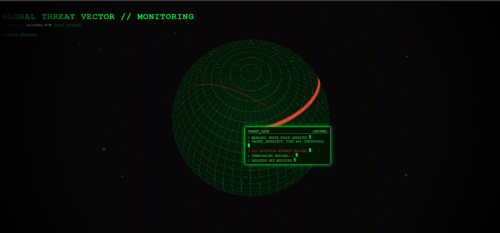

<div align="center">

# 🌐 DEFCON 1: CYBER THREAT GLOBE
### A Cinematic 3D Real-Time Attack Visualizer


<br>

> *"In the digital world, there are no borders. Only targets."*

<br>



</div>

---

## 💀 Project Overview

**DEFCON** is a browser-based, interactive 3D visualization aimed at simulating global cyber warfare. Built with **Three.js**, it renders a holographic earth monitoring "Cyber Attacks" in real-time.

It features a retro **CRT Monitor Aesthetic** with scanlines, screen curvature, and a glowing green hacker terminal interface.

---

## ⚡ Key Features

* **🌍 Holographic Globe:** A rotating, wireframe 3D earth using custom shaders.
* **🚀 Attack Vectors:** Procedural arcs simulating data packets traveling from source to target.
* **🌊 Impact Ripples:** Dynamic shockwaves appear on the globe surface upon impact.
* **📺 CRT Effect:** Old-school monitor vibes with vignette and scanline overlays.
* **💻 Interactive Terminal:** Hover over the globe to reveal a "Hacking Terminal" showing live logs.
* **🆔 Author Tag:** Custom HUD displaying `[AUTH_ID: N1xR00t~#]`.

---

## 🛠️ Tech Stack

* **Core:** HTML5, CSS3 (for UI overlays)
* **Logic:** Vanilla JavaScript
* **3D Engine:** Three.js (via CDN)
* **Effects:** Custom GLSL Shaders (Vertex & Fragment)

---

## 🚀 How to Run

No complex installation required. This is a standalone file.

1.  **Download** the `3D Real-Time Attack Visualizer` file.
2.  **Open** the file in any modern web browser (Chrome, Edge, Firefox).
3.  **Enjoy** the visualization!

> **Note:** An internet connection is required to load the Three.js library from the CDN.

---

## 🕹️ Controls
Left Click + Drag: Rotate the globe.

Scroll: Zoom in/out.

Mouse Hover: Reveal the "Target Lock" terminal and hacking logs.

---

## 📂 Project Structure

```text
DEFCON-1/
│
├── 3D Real-Time Attack Visualizer       # The complete source code (HTML + CSS + JS)
|
├── README.md        # Documentation
└── screenshot.png   # (Optional) Image for this README
```
---

## 🔓 Authority & License
This project is open-source under the MIT License. Permission Granted. You are free to fork, modify, and dominate this codebase.

<div align="center">


<h3>🛑 SECURE THE NETWORK. OWN THE CODE.</h3>

<p> <b>Architected by <a href="https://github.com/rehan-qx">[Muhammad Rehan Afzal]</a></b> </p>


</div>

